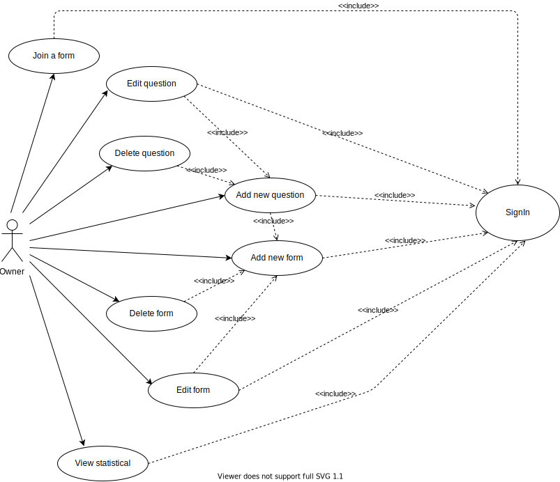

# Welcome to my project Decentralized Form (dForm)

This project is inspired by Google Forms.

- Everybody can make a customized survey, see an analysis of a certain form, share the survey link to anyone as they want.

- A Shared people will able to join a survey by using the shared link or using the survey id to join it.

- After that, all the answers will be acquired and show the statistics for the owner

## User case Diagram



- The action of an owner can execute inclues:
  - Create new form
  - Edit form
  - Delete from (also delete all the question of this form)
  - Add new question
  - Edit question
  - Delete question
  - Join a form
  - View statistical

- All of them need to be sign in first

## Folder Structure

- This project includes three folder
  - contract: Contains all the contract logic code of dForm. It was wrote in AssemblyScript
  - dapp: Contains all the web app code of dForm. This web app use the NextJs Framework
  - docs: Contains some figs, documentations (Todo)

1. Contract

   - The contract includes three main folders
     - Controller: Contain all of the logic code of contract. receive requests from users, Interacting with Near storage and return the useful data.
     - Model: Contain all abstract object of Contract (Like OOP).
     - Storage: Contall all utility funtions to interact with Near Persistent Storage.

1. dApp

   - The dApp inclues three main folders
     - backed: Contain utility function to connect to Near Wallet, Init the contract and so on
     - Components: Contain the whole logic code that will be used in this project
     - Pages: Contain all the pages of dApp

## How to run this project

Let work with contract first.

1. Contract
  
   - First of all, we need to login near wallet in terminal in the root folder of contract

    ```bash
    cd /contract
    near login
    ```

   - After that, install the node modules then build the contract

   ```bash
   npm i
   npx asb
   ```

   - Next, we need to change the **Contract Name** in **Config** file

   ```bash
   open the config.js

   vim /contract/src/config.js

   update the contract name as you want
   ```

   - The last, deploy the contract to testnet

   ```bash
   near deploy
   ```

1. dApp

    - First of all, we install the node modules
  
    ```bash
    cd /dapp/cform
    yarn
    or
    npm i
    ```

    - Update the contract name in the utility file
  
    ```bash
    cd /backed
    vim /config.js
    update the contract name as you want
    ```

    - The last, run server
  
    ```bash
    yarn dev
    or
    npm run dev
    ```

# If you have any questions, feel free to let me know

My contact

```
Email: toan93.hust@gmail.com
Skype: toan93.hust@gmail.com
```